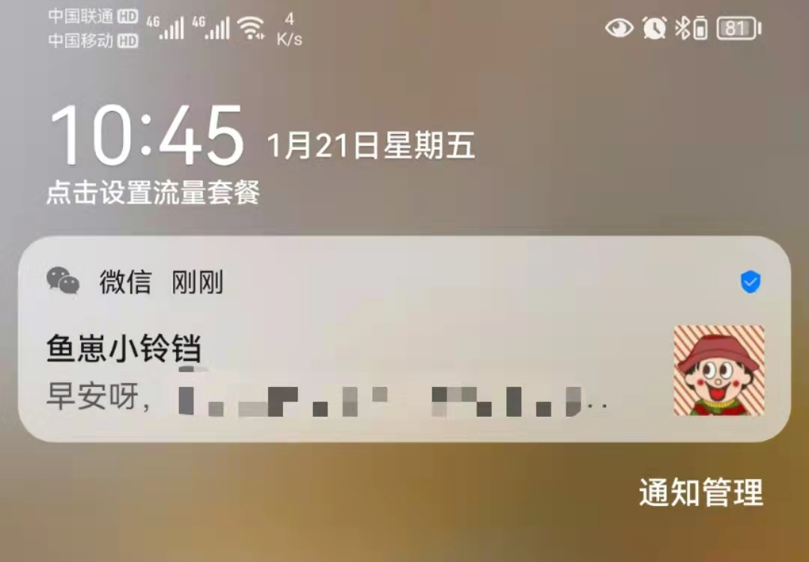
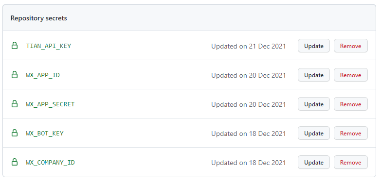

<h1 align="center">微信消息通知</h1>

<p align="center"></p>

<p align="center">
  <a href="https://github.com/JS-banana/notify-server">
    
  </a>
  <a href="https://github.com/JS-banana/notify-server/stargazers">
    
  </a>
  <a href="https://juejin.cn/post/7054013026801811470">
    
  </a>  
  <a href="https://github.com/JS-banana/notify-server/actions/workflows/goodMorning.yml">
    
  </a>
</p>

<p align="center">微信通知，每天给女朋友发早安、情话、诗句、天气信息等</p>

<p align="center">微信通知能力的核心链路已完成，就消息内容而言不限，基于此，可以根据个人需求完成各种私人定制</p>

<!-- [](https://github.com/JS-banana/notify-server/actions/workflows/goodMorning.yml) -->
<!-- [](https://github.com/JS-banana/notify-server/actions/workflows/goodAfternoon.yml)
[](https://github.com/JS-banana/notify-server/actions/workflows/goodEvening.yml) -->

## 已添加功能

- [x] 每天给女友发早安和土味情话
  - 个人定制化信息
  - 天气信息
  - 每日一言
  - 最美宋词
  - 雷人笑话
  - 土味情话
  - 每日英语
  - 睡前故事

## 效果

天气信息


其他信息

```txt
我的心里原本荒芜寸草不生，后来你来这走了一遭，奇迹般万物生长。

以心事下酒易大醉，大醉后易吐心事，心事全是你。

『岳飞《小重山》』欲将心事付瑶琴。知音少，弦断有谁听。

『ONE杂志』我觉得，人就像一粒种子。要做一粒好种子，身体、精神、情感都要健康。种子健康了，我们每个人的事业才能根深叶茂，枝粗果硕。

『网易云音乐热评』金钱的奴隶 欲望的游戏 打不破的桎梏 解不开的枷锁——奴隶

『一言』相思只在：丁香枝上，豆蔻梢头。

『每日英语（Jan 20, 2022』If I was going somewhere, I was running.
```

## 开发计划

数据获取不仅仅依赖于开放接口API，本应用运行于NodeJS环境，一切可行的手段都可以实现，如：爬虫、RSS订阅源、自开发脚本等

接下来探索更多数据获取的可能性，如有需要可考虑结合云服务和数据库

思路：

- [Everything is RSSible](https://docs.rsshub.app/)
- 爬虫、数据分析

计划：

- [ ] 每周豆瓣热映电影
- [ ] 随机照片

## 开发

需要的变量

```txt
WX_COMPANY_ID= 企业ID
WX_APP_ID= 应用ID
WX_APP_SECRET= 应用 Secret
TIAN_API_KEY= 天行数据 key
```

1. 注册企业微信 => 注册内部应用 => 获取到企业ID/应用ID/应用Secret
2. 注册[天行数据](#数据赋能API)会员 => 申请需要使用的接口 => 获取到接口API和KEY

> 企业微信的注册步骤见该仓库 [juejin-auto-checkin](#感谢)
>
> 本项目目前已使用到的天行数据接口见 [src/api/loveMsg](https://github.com/JS-banana/notify-server/src/api/loveMsg.ts)

### 本地开发

复制 `.env.example`文件重命名为 `.env`，并按照要求填写对应值，可以直接测试

### GitHub部署

如果要通过 `GitHub Action`使用，需要在 `Secrets` 中一一添加变量



GitHub Action每天7:30自动执行，脚本配置如下：[ci.yml](https://github.com/JS-banana/notify-server/blob/master/.github/workflows/goodMorning.yml)

```yml
schedule:
  # `分 时 天 月 周` 时按照标准时间 北京时间=标准时间+8 18表示北京时间早上2点
  # 早上 7:30
  - cron: '30 23 * * *'
```

## 数据赋能API

这里我们可以自己选择第三方开放API进行定制，或者自己定制

> 注：免费开源接口需要考虑服务稳定性！

目前接口数据能力主要由天行数据提供，随便注册一个账户会员即可，无门槛

天行数据：<https://www.tianapi.com/>

- 会员免费接口数量：**15个**
- 每日赠送次数：**100次**

注：如果采取该接口，需要在 **5.添加环境变量**这一步中，再添加Key的变量，作为天行数据接口使用时的必填参数

## 交流

欢迎大家一起交流和分享自己的创意和玩法

## 感谢

灵感来自：[juejin-auto-checkin](https://github.com/KaiOrange/juejin-auto-checkin)
