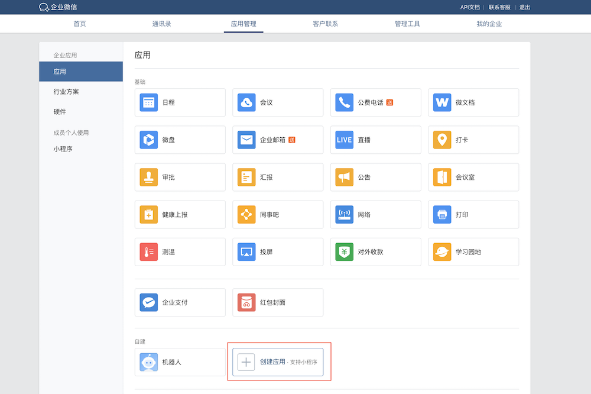
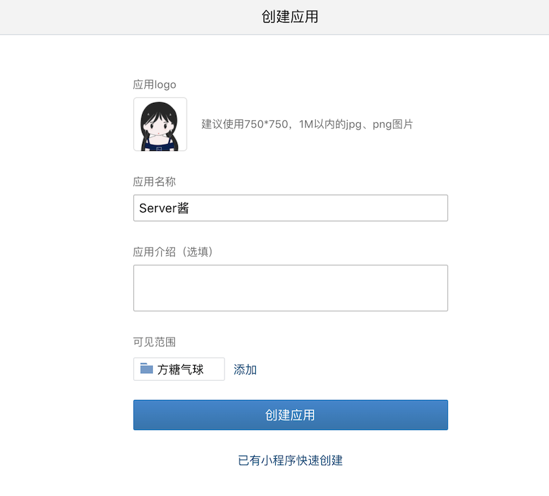
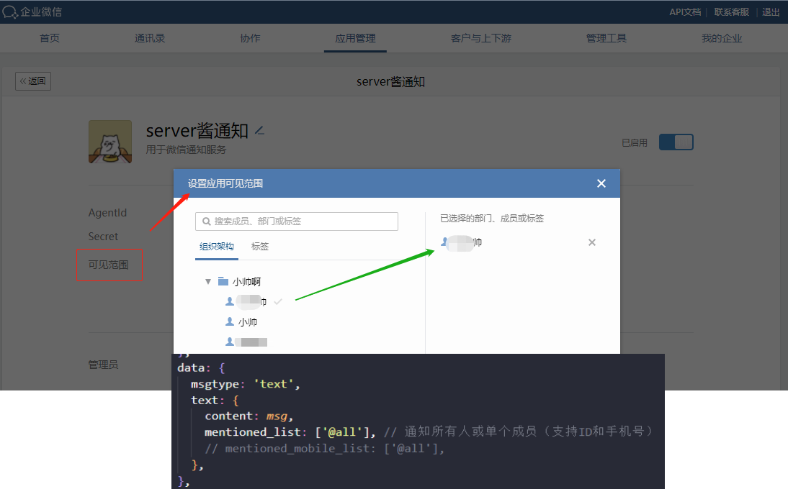
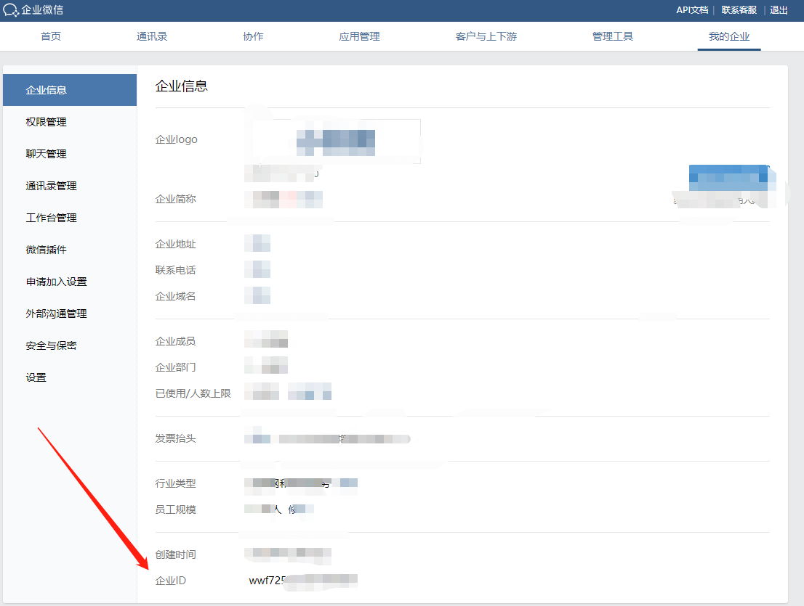
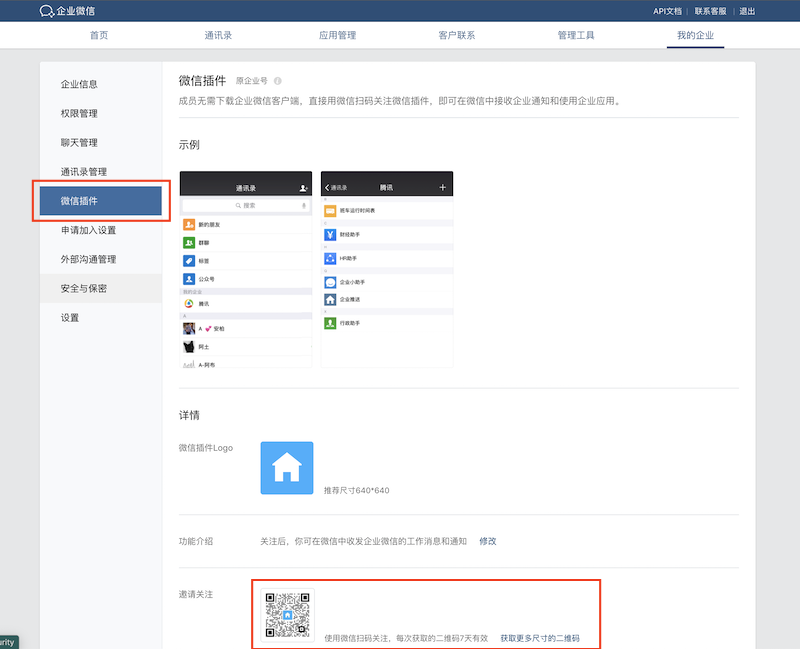
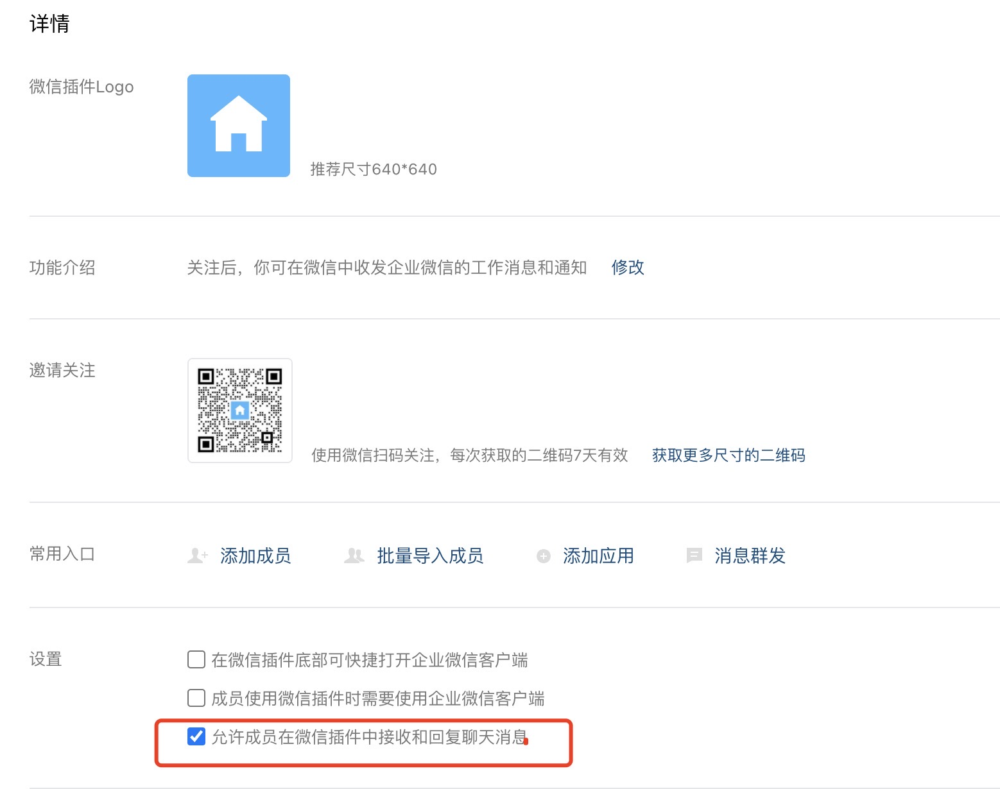
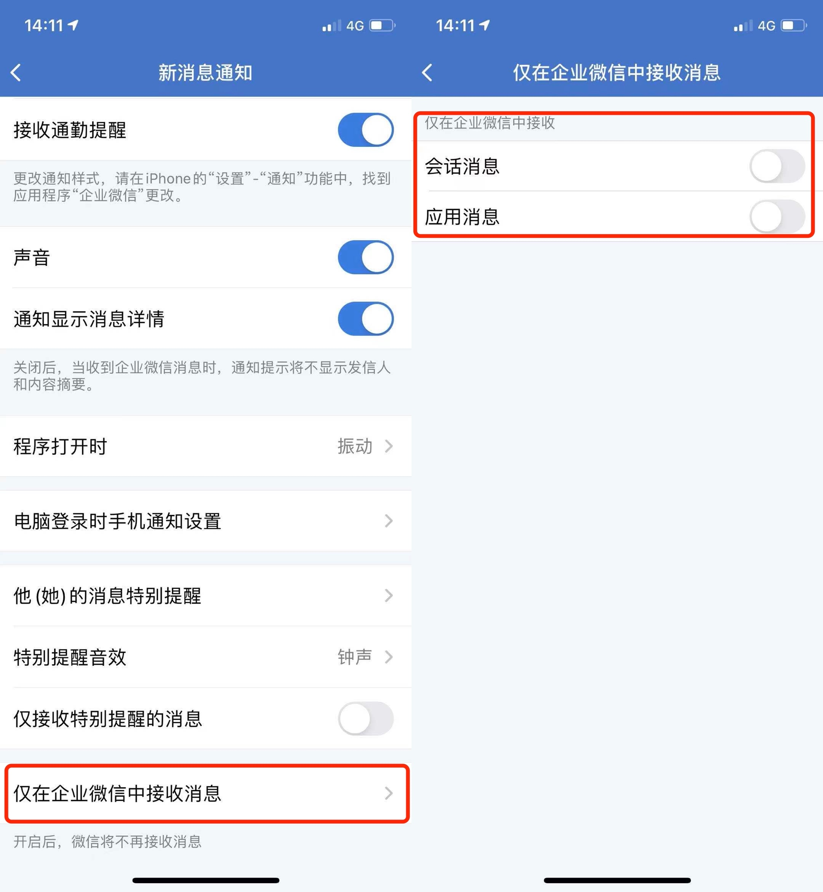

<h1 align="center">微信消息通知</h1>

<p align="center"></p>

<p align="center">
  <a href="https://github.com/JS-banana/notify-server">
    
  </a>
  <a href="https://github.com/JS-banana/notify-server/stargazers">
    
  </a>
  <a href="https://juejin.cn/post/7054013026801811470">
    
  </a>  
  <a href="https://github.com/JS-banana/notify-server/actions/workflows/goodMorning.yml">
    
  </a>
</p>

<p align="center">微信通知，每天给女朋友发早安、情话、诗句、天气信息等</p>
<p align="center">微信通知能力的核心链路已完成，就消息内容而言不限，基于此，可以根据个人需求完成各种私人定制</p>

<!-- [](https://github.com/JS-banana/notify-server/actions/workflows/goodMorning.yml) -->
<!-- [](https://github.com/JS-banana/notify-server/actions/workflows/goodAfternoon.yml)
[](https://github.com/JS-banana/notify-server/actions/workflows/goodEvening.yml) -->

## 已添加功能

- [x] 每天给女友发早安和土味情话
  <details><summary>点击查看详细内容</summary>
  
  - 个人定制化信息
  - 天气信息
  - 农历信息
  - 节日信息
  - 每日一言
  - 最美宋词
  - 雷人笑话
  - 土味情话
  - 每日英语
  - 睡前故事
  - 60s看世界
  </details>

## 效果

<!--  -->

<p align="center"></p>

<p align="center"></p>

```txt
星河耿耿，不如你眼眸璀璨，晚风习习，不如你温柔绮丽。

你闻到空气中有烧焦的味道吗？那是我的心在为你燃烧。

『苏轼《水调歌头》』有悲欢离合，月有阴晴圆缺，此事古难全。

『ONE杂志』爱情无非是年轻人一起喝酒做梦。

『网易云音乐热评』你相信吗 也许在另一个平行时空 有一个跟你长得很像很像的人 正在热烈得爱着那个你爱不到的人——想见你想见你想见你

『一言』你的眼中，明暗交杂，一笑生花。

『每日英语（Jan 9, 2022』In case I don't see you… Good afternoon, good evening, and good night.
```

## 数据赋能API

这里我们可以自己选择第三方开放API，或者自己定制

目前接口数据能力主要由天行数据提供，随便注册一个账户会员即可，无门槛

天行数据：<https://www.tianapi.com/>

- 会员免费接口数量：**15个**
- 每日赠送次数：**100次**

注：如果采取该接口，需要在 **添加环境变量**这一步中，再添加`Key`的变量值`TIAN_API_KEY`，作为天行数据接口使用时的必填参数

> 免费开源接口需要考虑服务稳定性！
>
> 本项目目前已使用到的天行数据接口见 [src/api/loveMsg](https://github.com/JS-banana/notify-server/src/api/loveMsg.ts)

**提醒**：

天气数据API接口：<https://www.tianqiapi.com/> 不再免费提供使用了，为了测试，新用户注册可免费使用2000次

非收费接口也有，不过目前看来功能有限（免费接口很容易这样用着用着就不行了😿）

为了求稳，决定暂时先不用免费的接口了，该功能使用天行数据提供的接口API，

简要说明：

其他非天气接口，注册会员用户每天可免费调用100次，个人使用足够了，对于天气这种特殊接口采用独立计费模式，不过价格也足够便宜，1元10000次，且申请接口后立即赠送500次。

## 开发

如果你想按照本项目功能配置使用脚本，请在注册完成对应的应用后，把所需的值按规范添加到环境变量即可直接测试使用，当然你也可以自行开发定制。

### 环境

nodejs版本推荐优先使用14.x及以上

### 需要的变量

```txt
WX_COMPANY_ID= 企业ID
WX_APP_ID= 应用ID
WX_APP_SECRET= 应用 Secret

TIAN_API_KEY= 天行数据 key
```

<details><summary>点击查看企业微信的注册步骤的详细示例</summary>

#### 第一步，注册企业

用电脑打开[企业微信官网](https://work.weixin.qq.com/)，注册一个企业。有手机号就可以注册，不用营业执照！不用营业执照！不用营业执照！

#### 第二步，创建应用

注册成功后，点「管理企业」进入管理界面，选择「应用管理」 → 「自建」 → 「创建应用」



应用名称随意填，可见范围选择公司名（或指定组织、个人，建议选择全部，然后在代码里指定用户）。



指定成员或组织



创建完成后进入应用详情页，可以得到应用 ID( agentid )①，应用 Secret( secret )②。


#### 第三步，获取企业 ID

进入「[我的企业](https://work.weixin.qq.com/wework_admin/frame#profile)」页面，拉到最下边，可以得到企业 ID③。



#### 第四步，推送消息到微信

进入「我的企业」 → 「[微信插件](https://work.weixin.qq.com/wework_admin/frame#profile/wxPlugin)」，拉到下边扫描二维码，关注以后即可收到推送的消息。



#### 无法接收到消息的异常情况处理

PS：如果出现`接口请求正常，企业微信接受消息正常，个人微信无法收到消息`的情况：

1. 进入「我的企业」 → 「微信插件」，拉到最下方，勾选 “允许成员在微信插件中接收和回复聊天消息”

    

2. 在企业微信客户端 「我」 → 「设置」 → 「新消息通知」中关闭 “仅在企业微信中接受消息” 限制条件

    

</details>

### 企信IP问题

消息发送成功，但提示IP错误的问题收集，详情请查看 [企业可信ip问题讨论](https://github.com/JS-banana/notify-server/issues/9)

### 本地开发

1. 可以直接fork本项目 => 克隆至本地
2. 复制 `.env.example`文件重命名为 `.env`，并按照要求填写对应变量值
3. 安装依赖

   ```bash
   # 推荐使用pnpm（如果未安装，可先全局安装`npm install -g pnpm`）
   pnpm install
   # or
   npm install
   ```

4. 执行脚本

   ```bash
   # 推荐使用这种方式
   pnpm start
   # or
   npm start
   ```

   或者

   ```bash
   # 先build构建再执行脚本
   # 1. build构建生成js文件
   pnpm build
   # 2. node执行js文件
   node dist/index.js
   ```

> 注：本项目不作为包发布，因此暂不考虑build构建，直接通过脚本运行即可，github服务已配置有缓存，无需担心安装性能问题

### GitHub部署

如果要通过 `GitHub Action`使用，需要在 `Secrets` 中一一添加变量,脚本会自动运行，当然，你也可以根据自身需求调整，见 `.github/workflows/goodMorning.yml`


GitHub Action每天7:30自动执行，脚本配置如下：[ci.yml](https://github.com/JS-banana/notify-server/blob/master/.github/workflows/goodMorning.yml)

```yml
schedule:
  # `分 时 天 月 周` 时按照标准时间 北京时间=标准时间+8 18表示北京时间早上2点
  # 早上 7:30
  - cron: '30 23 * * *'
```

## 全局配置

提供 `config.yml` 配置文件，方便快速自定义调整内容参数

如：女朋友所在城市为`蚌埠`，则 `city_name: 蚌埠`

yml语法比json更简洁易读，比较简单，[阮一峰 YAML 语言教程](https://www.ruanyifeng.com/blog/2016/07/yaml.htmls)

## 开发计划

数据获取不仅仅依赖于开放接口API，本应用运行于NodeJS环境，一切可行的手段都可以实现，如：爬虫、RSS订阅源、自开发脚本等

接下来探索更多数据获取的可能性，如有需要可考虑结合云服务和数据库

思路：

- [Everything is RSSible](https://docs.rsshub.app/)
- 爬虫、数据分析

计划：

目前项目结构现在看来是有点混杂，接下来首要任务就是进行模块和功能的拆分、梳理，分层管理。

- [x] 天气接口重构
- [ ] 分层：核心能力模块与衍生功能点进行模块划分调整
- [ ] 女友生日倒计时（一个月时开始计时通知，消息展现在卡片中）
- [ ] 美丽短句的开头语句优化调整
- [ ] 每周豆瓣热映电影
- [ ] 随机照片

<!-- ## 交流

欢迎大家一起交流和分享自己的创意和玩法[discussions](https://github.com/JS-banana/notify-server/discussions) -->

<!-- ## 感谢

灵感来自：[juejin-auto-checkin](https://github.com/KaiOrange/juejin-auto-checkin) -->

## 更新记录

- 2022-01-25：README文档更新、添加图示，免费天气接口稳定性及功能标注
- 2022-01-26：天气接口调整、功能调整，见分支`feat/weather`
- 2022-02-09：增加容错处理，增加独立配置文件方便用户定制
- 2022-08-24：fix 美丽短句config配置问题[adf87fc](https://github.com/JS-banana/notify-server/commit/adf87fc04c78547fbd7070be01b1e147b6a4b856)，完善文档

## 交流

可关注我公众号（前端小帅），加我微信一起交流学习~

<table>
  <tr>
    <td valign="top">
      
    </td>
  </tr>
</table>

<!--  -->

## 版权声明

本项目基于 [MIT](LICENSE) 开源规范，使用转载请注明出处和作者。

## 请作者喝咖啡☕

如果觉得这个项目还不错，或者这个项目对你有所帮助，可以选择请作者喝咖啡~


## 感谢star

你的 star 就是对我的最大支持🙏

[](https://starchart.cc/JS-banana/notify-server)
