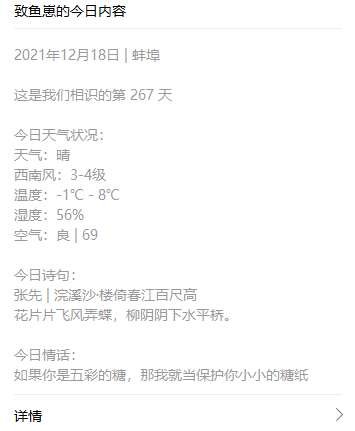

# 消息通知

[](https://github.com/JS-banana/notify-server/actions/workflows/goodMorning.yml)
[](https://github.com/JS-banana/notify-server/actions/workflows/goodAfternoon.yml)
[](https://github.com/JS-banana/notify-server/actions/workflows/goodEvening.yml)

微信通知，每天给女朋友发早安、午安、晚安，和情话与诗句等等

## 功能

- [x] WXWorkNotify：自定义应用通知
- [x] WXbot：群机器人通知
- [x] 天行数据提供的接口能力，包括但不限天气、新闻、知识等

## 开发计划

数据获取不仅仅依赖于开放接口API，本应用运行于NodeJS环境，一切可行的手段都可以实现，如：爬虫、RSS订阅源、自开发脚本等

接下来探索更多数据获取的可能性，如有需要可考虑结合云服务和数据库

- [ ] [Everything is RSSible](https://docs.rsshub.app/)
- [ ] 爬虫、数据分析

## 效果

### 自定义应用消息通知



### 群机器人

```txt
今日笑话：
偶睡觉的时候喜欢平躺着把腿弯向两侧，往往会占很大的床铺面积，于是
老婆很不满，问：你为什么睡觉像只蛤蟆？我答：养蝌蚪啊。

一句一言：
龙儿是我的，谁都不准碰！

今日英语（Dec 18 2021）：
While there is life, there is hope.
生命不息，希望不止。
```

## 开发

复制 .env.example文件重命名为 .env，并按照要求填写对应值，可以直接测试

如果要通过 GitHub Action使用，需要在 Secrets 中一一添加变量

### 接口数据提供者

免费开源接口需要考虑服务**稳定性**！

目前接口数据能力主要由天行数据提供，随便注册一个账户会员即可，无门槛

- 天行数据：<https://www.tianapi.com/>
  - 会员免费接口数量：15个
  - 每日赠送次数：100次

## 企业微信自定义应用消息通知

文档：<https://open.work.weixin.qq.com/api/doc/90001/90143/90372>

### 步骤

3个必要参数：

```txt
WX_COMPANY_ID= 公司ID
WX_APP_ID= 应用ID
WX_APP_SECRET= 应用 Secret
TIAN_API_KEY= 天行数据 key
```

1. 获取token

    根据 **企业ID** 和 **应用Secret** 获取token

2. 发送消息

    传入token，并调用发送消息接口进行发送

## 群机器人通知

直接获取拿到机器人的 webhookURL 即可，post方法，参数格式基本相同

## 感谢

灵感来自：[juejin-auto-checkin](https://github.com/JS-banana/juejin-auto-checkin)
